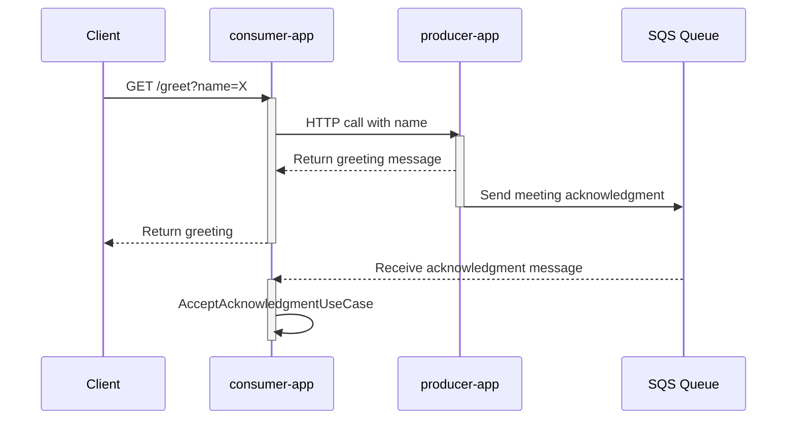

[](https://codesoapbox.dev/)

# Spring Boot contract testing example

- [Overview](#overview)
- [Prerequisites](#prerequisites)
- [Project architecture](#project-architecture)
- [Getting started](#getting-started)
  * [Generating and running contract tests](#generating-and-running-contract-tests)
  * [Running the applications](#running-the-applications)
- [Contract testing](#contract-testing)
  * [Contract testing glossary](#contract-testing-glossary)
- [Known issues](#known-issues)
  * [[Spring Cloud Contract bug - StubRepository treats every file as a potential mapping, leading to flaky tests](https://github.com/spring-cloud/spring-cloud-contract/issues/2163)](#-spring-cloud-contract-bug---stubrepository-treats-every-file-as-a-potential-mapping--leading-to-flaky-tests--https---githubcom-spring-cloud-spring-cloud-contract-issues-2163-)
  * [[Spring Cloud Contract missing feature - failing test generation does not failt he build](https://github.com/spring-cloud/spring-cloud-contract/issues/1675)](#-spring-cloud-contract-missing-feature---failing-test-generation-does-not-failt-he-build--https---githubcom-spring-cloud-spring-cloud-contract-issues-1675-)
- [References](#references)

## Overview
A sample project demonstrating contract testing between two Spring Boot applications using Spring Cloud Contract.
The project showcases both HTTP and message-based (SQS) contract testing.

The code adding contract testing is available as a [single commit](https://github.com/daniel-frak/contract-testing-sample/commit/529ab3f6680d8e067fc6bf6b9b1dcee1ac48216e).

## Prerequisites

- JDK 21+
- [Docker](https://docs.docker.com/get-docker/),
  [Docker-Compose](https://docs.docker.com/compose/install/) (for LocalStack)

## Project architecture

This repository contains sample code with two applications (`producer-app` and `consumer-app`) using contract testing
to maintain contracts for:

- The HTTP API of `producer-app`
- The SQS queue structure (used by both applications)

A `consumer-app` endpoint can be called to receive a greeting. The greeting message will be received from `producer-app`
via an internal HTTP call. Upon receiving that call, `producer-app` will also send a meeting acknowledgment to an SQS
queue. Meanwhile, `consumer-app` listens to that queue and will trigger `AcceptAcknowledgmentUseCase` upon receiving
a message.



The applications follow a Ports & Adapters architecture.
Their root packages represent features - greeting and acknowledging meetings.

The contracts are stored in the `producer-app` codebase.
Alternatively, the contracts could be stored in a completely separate repository:

https://docs.spring.io/spring-cloud-contract/reference/using/cdc-external-repo.html

## Getting started

### Generating and running contract tests
```shell
# First, install all contract testing stubs into your local .m2 folder (necessary for the consumer-app tests to pass):
cd producer-app
./../mvnw clean install -DskipTests

# Then build the apps with tests
cd ..
./mvnw clean verify
```

### Running the applications

To start a local instance of all external dependencies, use the following command in the root of this repository:

```shell
docker compose -f docker/docker-compose.yml up -d
```

You can run the applications with the following commands:

```shell
# Terminal 1
cd producer-app
./../mvnw spring-boot:run

# Terminal 2
cd consumer-app
./../mvnw spring-boot:run
```

After both applications start, calling `http://localhost:8080/greet?name=some-name`
will make `consumer-app` call `producer-app` and return a response from it:

```shell
curl http://localhost:8080/greet?name=some-name
```

A moment later, `consumer-app` will log that it received a message via SQS.

## Contract testing

Individual contracts can be found on the producer side in `src/test/resources/contracts`.

The internal endpoint is tested using the contract found in
`producer-app/src/test/resources/contracts/http/should_return_greeting.yml` on the producer's side,
then using generated stubs in `ProducerAppWebClientIT` on the consumer's side.

The SQS queue is tested using the contract found in
`producer-app/src/test/resources/contracts/sqs/should_send_reminder.yml` on the producer's side,
then using generated stubs in `MeetingAcknowledgmentSqsListenerIT` on the consumer's side.

The contracts produce the following test classes in `producer-app`:

- `HttpIT` - contract tests for HTTP endpoints, extends `HttpContractTestBaseClass`
- `SqsIT` - contract tests for SQS queues, extends `SqsQueueContractTestBaseClass`

On the consumer side, there is:

- `@WebClientContractTest` annotation - auto-configures the Spring Boot context for testing Spring WebClients
  and stubs out endpoints according to their contracts.
- `@SqsListenerContractTest` annotation - auto-configures the Spring Boot context for testing SQS listeners
  and stubs out messages according to their contracts.

Whatever is covered by a contract test does not need to be covered by other tests, which is why controllers
on the producer's side usually will not have any hand-written tests.

### Contract testing glossary

- **Producer** - a service which exposes an API or sends a message
- **Consumer** - a service which consumes an API or listens to a message
- **Contract** - an agreement between a producer and a consumer on what the API or message structure will look like
- **Consumer-driven contracts** - an approach where the consumer drives the changes of the API.
  In the case of this project, the consumer may drive the changes by issuing Pull Requests for the producer code base
  containing additions or modifications to the contracts. Alternatively, the project could be configured so that
  all contracts are stored in a completely separate repository, which both the producer and consumer use.

## Known issues

### [Spring Cloud Contract bug - StubRepository treats every file as a potential mapping, leading to flaky tests](https://github.com/spring-cloud/spring-cloud-contract/issues/2163)

As of `spring-cloud-dependencies:2024.0.1`, Spring Cloud Contract `StubRepository` walks the entire contract folder tree
and tries to deserialize every file into a `com.github.tomakehurst.wiremock.stubbing.StubMapping`.
This poses a problem especially when the project uses `bodyFromFile`. 
In this sample project, `greeting_request_body.json` and `greeting_response_body.json`
are used as `bodyFromFile` in `should_return_greeting.yml` 
and are both evaluated as potential mappings by `StubRepository`.

If, for example, `greeting_request_body.json` was simpler,
e.g., if it consisted only of a single property called `name`,
then it would be successfully deserializable into `StubMapping`,
creating an empty "catch-all" mapping, which would cause all contract tests to be flaky.

### [Spring Cloud Contract missing feature - failing test generation does not failt he build](https://github.com/spring-cloud/spring-cloud-contract/issues/1675)

If, for whatever reason, a contract cannot be converted into a test, the build will not fail — only a warning will be
logged.
A workaround for this was posted as a comment to the linked issue.

## References
- [Spring Cloud Contract Documentation](https://spring.io/projects/spring-cloud-contract)

<small><i><a href='http://ecotrust-canada.github.io/markdown-toc/'>Table of contents generated with
markdown-toc</a></i></small>