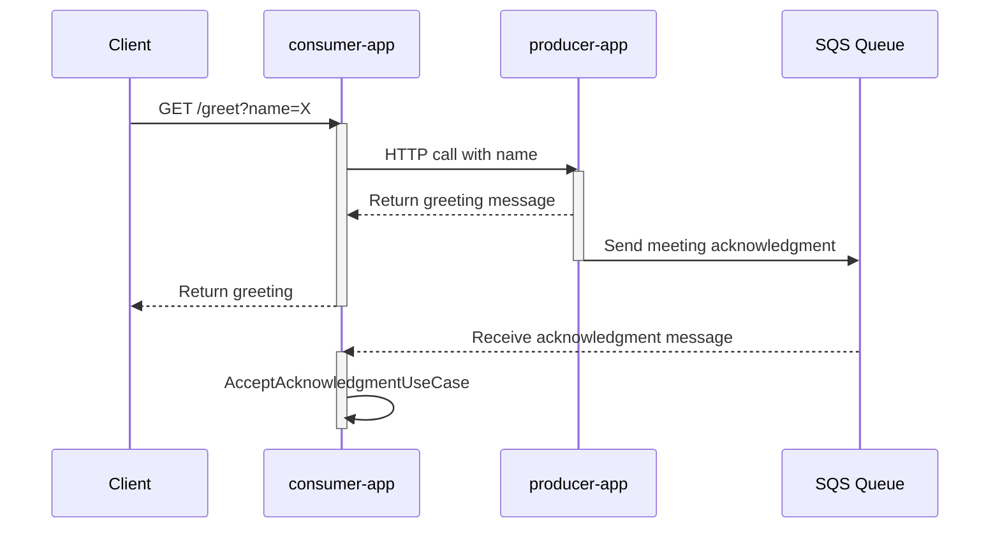

[](https://codesoapbox.dev/)

# Spring Boot contract testing example

- [Prerequisites](#prerequisites)
- [Project architecture](#project-architecture)
- [Getting started](#getting-started)
    * [Running the applications](#running-the-applications)

## Prerequisites

- JDK 21+
- [Docker](https://docs.docker.com/get-docker/),
  [Docker-Compose](https://docs.docker.com/compose/install/) (for LocalStack)

## Project architecture

This repository contains sample code with two applications (`producer-app` and `consumer-app`).

A `consumer-app` endpoint can be called to receive a greeting. The greeting message will be received from `producer-app`
via an internal HTTP call. Upon receiving that call, `producer-app` will also send a meeting acknowledgment to an SQS
queue. Meanwhile, `consumer-app` listens to that queue and will trigger `AcceptAcknowledgmentUseCase` upon receiving
a message.



The applications follow a Ports & Adapters architecture.
Their root packages represent features - greeting and acknowledging meetings.

## Getting started

### Running the applications

To start a local instance of all external dependencies, use the following command in the root of this repository:

```shell
docker compose -f docker/docker-compose.yml up -d
```

You can run the applications with the following commands:

```shell
# Terminal 1
cd producer-app
./../mvnw spring-boot:run

# Terminal 2
cd consumer-app
./../mvnw spring-boot:run
```

After both applications start, calling `http://localhost:8080/greet?name=some-name`
will make `consumer-app` call `producer-app` and return a response from it:

```shell
curl http://localhost:8080/greet?name=some-name
```

A moment later, `consumer-app` will log that it received a message via SQS.

<small><i><a href='http://ecotrust-canada.github.io/markdown-toc/'>Table of contents generated with
markdown-toc</a></i></small>